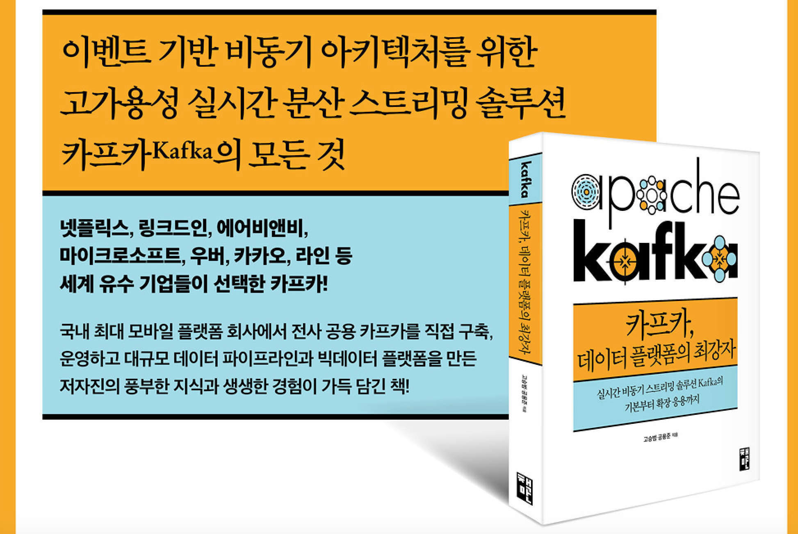

# 카프카, 데이터 플랫폼의 최강자
### 부제: 실시간 비동기 스트리밍 솔루션 Kafka의 기본부터 확장 응용까지
#### | [고승범](https://facebook.com/peter5236), [공용준](https://www.facebook.com/sstrato.kong) 지음 | [책만](http://www.onlybook.co.kr) |

| 432쪽 | 30,000원 | 2018년 4월 26일 출간 | ISBN 9791196203726 |
<br>

판매처: [교보문고](http://www.kyobobook.co.kr/product/detailViewKor.laf?barcode=9791196203726), [YES24](http://www.yes24.com/24/goods/59789254), [인터파크](http://book.interpark.com/product/BookDisplay.do?_method=detail&sc.shopNo=0000400000&sc.prdNo=282814470), [알라딘](http://www.aladin.co.kr/shop/wproduct.aspx?ItemId=142100738), [강컴](http://www.kangcom.com/sub/view.asp?sku=201804170005), [반디앤루니스](http://www.bandinlunis.com/front/product/detailProduct.do?prodId=4168488)<br>
도서 문의: support (at) onlybook.co.kr / kafka-book (at) daum.net



> __데이터 플랫폼의 핵심 컴포넌트로 각광받고 있는, 이벤트 기반 비동기 아키텍처를 위한 고가용성 실시간 분산 스트리밍 솔루션 카프카(Kafka)의 모든 것!__<br>

> __국내 최대 모바일 플랫폼 회사인 카카오에서 '전사 공용 카프카' 서비스를 운영하고, 데이터 파이프라인과 빅데이터 플랫폼을 구축한 저자들의 풍부한 지식, 생생한 실전 경험, 노하우가 가득 담긴 책!__<br>

카프카 사용자는 물론이고 아직 카프카를 도입하지 않은 기업이나 담당자들을 대상으로, 카프카를 손쉽게 설치하고 구성하는 방법, 비동기 메시지 처리법과 함께 프로그램 개발 방법도 차근차근 익혀본다. 또한, 손쉽게 메시징 시스템을 도입할 수 있도록 카프카의 내부 디자인과 프로듀서/컨슈머의 특징을 심도 있게 다뤘다. 

아울러, 카프카를 데이터 버스로 활용해서 실시간 데이터를 분석하는 방법을 여러 방면의 예를 들어 자세히 설명하고, 카프카 기반의 실시간 데이터 분석 시스템을 개발하는 과정을 자세한 설명과 함께 샘플코드도 제공하고 있어서 **실시간/배치 분석 업무를 수행하는 빅데이터 분석가나 데이터 엔지니어, 이벤트 기반 방식의 비동기 시스템 개발 업무를 맡은 모든 개발자**에게 도움이 될 것이다.
<hr>

## 추천의 글

**"친절한 설명과 그림으로 카프카의 기초부터 실무 적용까지 잘 정리되어 있어서 초보자들도 쉽게 이해할 수 있다."** 
_- 강소륜, 넷마블게임즈 인프라실 이사_

**"오랜 기간동안 현업에서 직접 개발하고 운영하면서 다양한 문제를 해결해온 저자들의 열정과 고민이 책 속에 고스란히 담겨 있다."** 
_- 심탁길, CJ 올리브네트웍스 빅데이터센서 상무_

**"카프카는 흔히 빅데이터 시스템을 구성할 때만 사용하는 것으로 착각하는 경우가 많다. 카프카는 데이터 수집뿐만 아니라 이벤트 드리븐 시스템을 통한 느슨한 구현에도 최적화되어 있다."** 
_- 김형준, 베터코드 CTO_

**"안정적이며 높은 성능을 발휘하는 데이터 파이프라인을 구축하고 여기서 나오는 데이터를 빠르고 정확하게 처리하는 애플리케이션을 만들려는 모두에게 적극 추천한다."** 
_- 박재호, 데일리인텔리전스 CTO_

**"1년 전에 이 책이 나왔더라면, 내가 카프카를 적용하는 데 그 많은 고생을 하지 않았을 텐데."** 
_- 이상민 / NHN 엔터테인먼트 기술리더_

**"실무에서 체득한 저자들의 다양한 경험을 바탕으로 기본 개념, 운영고려사항, 데이터 파이프라인을 다루고, 최근에 나온 KSQL까지 포함하고 있다."** 
_- 김태완, 한국 오라클 빅데이터 & Data Analytics 팀 부장_

<hr>

## 이 책의 독자 대상
- 카프카를 배우고자 하는 초보자부터 카프카를 직접 운영하는 관리자
- 데이터 표준화와 실시간 처리에 대해 고민하는 개발자
- 이벤트 소싱을 활용한 데이터 처리를 활용하려는 개발자
- 효율적으로 데이터를 수집하고 처리, 분석하기를 원하는 개발자
- 실시간 데이터 파이프라인을 구축하고 애플리케이션을 개발하는 아키텍트와 개발자
- 이벤트 기반 방식의 비동기 시스템 개발 업무를 맡은 모든 개발자

## 이 책의 내용과 특징
- 카프카의 탄생 배경과 동작 원리
- 주키퍼와 카프카 설치 및 클러스터 구성에 대한 자세한 설명
- 자바와 파이썬을 이용한 카프카 프로듀서와 컨슈머의 예제 코드와 활용 
- 카프카 운영에 필요한 주요 명령어 설명
- 주키퍼와 카프카의 노드 추가와 스케일 아웃 가이드
- 편리한 GUI 도구인 카프카 매니저의 설치와 활용
- 이해하기 쉽게 그림으로 설명하는 주요 카프카 아키텍처
- 카프카를 활용한 실시간 스트림 분석 완벽 가이드
- 엘라스틱서치와 아파치 나이파이 등을 활용한 데이터 파이프라인 구성 예제

## 지은이 소개
### [고승범](https://facebook.com/peter5236) 
현재 카카오에 재직 중인 시스템 엔지니어로서 카카오와 관련된 여러 서비스를 지원하며 전사 공용 카프카와 래빗엠큐를 운영하고 있다. 새로운 것에 호기심이 많은 편이며 열심히 노력하는 엔지니어다. 팝잇(Popit.kr) 사이트의 저자로 활동 중이며 카프카 관련 글을 연재하고 있다. 

### [공용준](https://www.facebook.com/sstrato.kong) 
국내 최대 메신저 회사에서 클라우드 서비스 개발 리딩을 맡고 있으며, 데이터 센터 자동화, 프라이빗/퍼블릭 클라우드 서비스와 그에 필요한 기술을 연구, 개발해서 실제 서비스에 적용하고 있다. 2015년에는 캐나다 밴쿠버에서 열린 오픈스택 서밋에서 국내 개발자 중 최초로 ‘SDN without SDN’이라는 제목으로 발표했고, 2016년(도쿄)과 2017년(몬트리얼) Netdev 컨퍼런스에서 역시 국내 최초로 확장가능한 컨테이너 네트워크에 대해 발표했다. 한국 데이터베이스 진흥원 자문위원, 클라우드컴퓨팅조합에서 멘토로도 활동 중이다. 

<hr>

## 정오표 
__<2018년 4월 26일 초판 1쇄 수정 내용>__

__p8. 지은이 소개 6째 줄__<br>
카프카 관련 ~~연재~~ 글을 연재하고 있습니다. <br>
-> 카프카 관련 글을 연재하고 있습니다.

__p32. 2번째 스택오버플로 그림 번호__ (편집 오류)<br>
(2) -> __(3)__

__p36. 끝에서 9째 줄__<br>
실시간 트~~랙~~잭션 -> 실시간 트'랜'잭션 <br>

__p41. 끝에서 4째 줄__<br>
각각의 메시지 저장소에 저장하면 -> 각각의 메시지 저장소에 __데이터를__ 저장하면<br>

__p59. 본문 끝에서 2째 줄__<br>
크게 프로듀서, ~~브로커~~, 컨슈머, 주키퍼로 분류할<br>
-> 크게 프로듀서, __카프카(브로커)__, 컨슈머, 주키퍼로 분류할

__p74. 본문 끝에서  3째 줄__ : d 빠짐 <br> 
SyslogIentifier: ->  SyslogI"d"entifier:

__p89. 본문 12째 줄 2번째 코드부__<br>
--daemon -> __-daemon__<br>

__p113. 9째 줄__ (편집 오류)<br>
20초가 넘는 시간 동안 장~~여기까지 문단 전체 들여넣기 해주세요.~~<br>
-> 20초가 넘는 시간 동안 __장애 상황이 발생할 수 있습니다.__

__p114. 표 3-2 두 번째 열 제목__<br>
프로듀서 수 -> __서버 수__<br>

__p119. 그림 3-10 바로 윗 줄__<br>
~~동작하지를~~ 살펴보겠습니다. -> __동작하는지__ 살펴보겠습니다.

__p131. 본문 2째줄과 3째줄__<br>
마지막 리더를 기다리는 방법(2번 방안) -> __(1번 방안)__<br>
빠른 서비스를 제공하기 위한 방법(1번 방안) -> __(2번 방안)__<br>

__p157. 마지막 항목__<br>
* &gt; acks=0 -> __acks=0__ (> 빠져야 함)<br>

__p158. 첫째, 둘째 항목__<br>
* &gt; acks=1 -> __acks=1__ (> 빠져야 함)<br>
* &gt; acks=all -> __acks=all__ (> 빠져야 함)<br>

__p183. 밑에서 10째 줄__ (편집 오류) <br>
하고 나면 ~~계~~실행된 상태를 -> 하고 나면 실행된 상태를 <br>

__p195. 1째~2째 줄__<br>
컨슈머 명령어 -> __프로듀서__ 명령어<br>

__p244. 2째 줄__<br>
추이를 모니터링 화면을 -> 추이를 __보여주는__ 모니터링 화면을<br>

__p267. 밑에서 3째줄__<br>
라이브러리를 ~~이용여~~ 프로그램으로 -> 라이브러리를 __이용'해'__ 프로그램으로<br>

__p294. 7.6.2절 제목 윗줄__<br>
작업을 설명해~~뽀~~겠습니다. -> 작업을 설명해'보'겠습니다.

__p295. 3째 줄__ 영문 o 빠짐 <br> 
역할을 하는 RuteOnAttribute -> 역할을 하는 __RouteOnAttribute__

__p295. 4째 줄__<br>
내장 함수'화' 논리 표현식을 -> 내장 함수"와" 논리 표현식을 <br>

__p318. 예제 8-3 7째줄 System.out.println("topology started"); 코드행 -> 아래쪽으로 이동__<br>
(https://github.com/onlybooks/kafka/blob/master/chapter8/Pipe-complete.java 전체 파일 참조)
```
 try {
    streams.start();
    System.out.println("topology started");
    latch.await();
 } catch (Throwable e) {
 ```
        
__p318. 예제 8-3 마지막줄 코드부 전체 삭제__<br> 
~~final CountDownLatch latch = new CountDownLatch(1);     1~~ <br>

__p321. 그림 8-8 아래쪽 코드부 첫 줄__<br>
$ src/main/java/myapps/Pipe-complete.java <br>
-> $ __cp__ src/main/java/myapps/Pipe-complete.java <br>

__p322. 본문 6째 줄__<br>
flatMapValue -> __flatMapValues__ <br>

__p322. 본문 10째 줄__<br>
flatMapValue를 사용합니다. -> __flatMapValues__ 를 사용합니다. <br>

__p322. 예제 8-4 마지막 줄 다음에 다음 코드행 추가__<br>
words.to(“streams-linesplit-output”);<br>

__p323. 8째 줄 코드행 끝에 ; 추가__<br>
words.to(“streams-linesplit-output”)__;__ <br>

__p328. 예제 8-6__<br>
__3째줄 세미콜론(;) 삭제__:  store")); ❷ -> store")) ❷ <br>
__6째줄 닫는 괄호 추가__:  Long)); ❹ -> Long))); ❹ <br>
__본문 마지막줄__:  주요 코드부는 예제 8-7과 같습니다(완전한 코드는 깃허브 페이지 https://github.com/onlybooks/kafka/에서 다운로드할 수 있습니다). <br>

__p329. 예제 8-7 다음 마지막 코드부 4줄 모두 삭제__<br>
```
KTable<String, Long> counts =
source.flatMapValues(new ValueMapper<String, Iterable<String>>(){
    @Override
    public Iterable<String> apply(String value) {
```

__p338. 그림 9-1 점선 박스 누락 -> samza 주변에 점선 박스 들어가야 함__<br>
<br>

__p343. 본문 6, 7째줄__<br>
필요한 경우 command -> 필요한 경우 __ksql__commands__ <br>
command 토픽에는 -> __ksql_commands__ 토픽에는 <br>

__p345. '스트림 생성' 절 3째 줄__<br>
CREATE ~~TABLE~~ 스트림이름 ... —> CREATE __STREAM__ 스트림이름 ...<br> 

__p348. 밑에서 6째 줄 코드행__<br>
CREATE STREAM __테이블_name__ —> CREATE STREAM __table_name__ <br>

__p350. 2번 항목 2째 줄__<br>
images, ports, volume 항목 -> __image__, ports, __volumes__ 항목<br>

__p353. 본문 8째줄, 밑에서 4째줄__<br>
$docker-compose up d -> $docker-compose up __-d__ <br>
docker-compose up d 명령어를 실행하면 -> docker-compose up __-d__ 명령어를 실행하면 

__p355. 4째 줄__<br>
--bootstrap 옵션 -> --bootstrap __-server__ 옵션

__p356. 4째 줄__<br>
Page_view 토픽 -> __Pageviews__ 토픽 <br>

__p356. 5~6째 줄__<br>
pages_region 스트림 -> __pageviews_regions__ 스트림<br>
pages_enriched_r8_r9, pageview_region -> __pageviews_enriched_r8_r9__, __pageviews_regions__

__p359. 6번 항목__<br>
quickstart=user 옵션 -> quickstart=__users__ 옵션

__<2018년 7월 22일 등록 (1쇄, 2쇄 확인 필요)>__

__p153. 첫 코드부 3째 줄 마지막 명령__<br>
create -> __--create__

__p157. bootstrap.servers 항목 설명 2째 줄__<br>
클라이언의 요청을 -> 클라이언__트__의 요청을

<hr>

## 차례

## 1부 카프카를 시작하며
### 1장  카프카란 무엇인가
1.1  카프카의 탄생 배경<br>
1.2  카프카의 동작 방식과 원리<br>
1.3  카프카의 특징<br>
1.4  카프카의 확장과 발전<br>
1.5  정리<br>

### 2장  카프카와 주키퍼 설치
2.1  카프카 관리를 위한 주키퍼<br>
2.2  주키퍼 설치<br>
2.3  카프카 설치<br>
2.4  카프카 상태 확인<br>
2.5  카프카 시작하기<br>
2.6  정리<br>

## 2부 기본 개념과 운영 가이드
### 3장  카프카 디자인
3.1  카프카 디자인의 특징 <br>
3.2  카프카 데이터 모델<br>
3.3  카프카의 고가용성과 리플리케이션<br>
3.4  모든 브로커가 다운된다면<br>
3.5  카프카에서 사용하는 주키퍼 지노드 역할<br>
3.6  정리<br>

### 4장  카프카 프로듀서
4.1  콘솔 프로듀서로 메시지 보내기<br>
4.2  자바와 파이썬을 이용한 프로듀서<br>
4.3  프로듀서 활용 예제<br>
4.4  프로듀서 주요 옵션<br>
4.5  메시지 전송 방법<br>
4.6  정리<br>

### 5장  카프카 컨슈머
5.1  컨슈머 주요 옵션<br>
5.2  콘솔 컨슈머로 메시지 가져오기<br>
5.3  자바와 파이썬을 이용한 컨슈머<br>
5.4  파티션과 메시지 순서<br>
5.5  컨슈머 그룹<br>
5.6  커밋과 오프셋<br>
5.7  정리<br>

### 6장  카프카 운영 가이드
6.1  필수 카프카 명령어<br>
6.2  주키퍼 스케일 아웃<br>
6.3  카프카 스케일 아웃<br>
6.4  카프카 모니터링<br>
6.5  카프카 매니저<br>
6.6  카프카 운영에 대한 Q&A<br>
6.7  정리<br>

## 3부 카프카의 확장과 응용
### 7장  카프카를 활용한 데이터 파이프라인 구축
7.1  카프카를 활용한 데이터 흐름도<br>
7.2  파일비트를 이용한 메시지 전송<br>
7.3  나이파이를 이용해 메시지 가져오기<br>
7.4  실시간 분석을 위해 엘라스틱서치에 메시지 저장<br>
7.5  키바나를 이용해 엘라스틱서치에 저장된 데이터 확인<br>
7.6  현재의 토픽을 이용해 새로운 토픽으로 메시지 재생산<br>
7.7  정리<br>

### 8장 카프카 스트림즈 API
8.1  스트림 프로세싱 기초<br>
8.2  카프카 스트림즈<br>
8.3  카프카 스트림즈를 위한 환경설정<br>
8.4  파이프 예제 프로그램 만들기 <br>
8.5  행 분리 예제 프로그램 만들기<br>
8.6  단어 빈도수 세기 예제 프로그램 만들기<br>
8.7  정리<br>

### 9장  카프카 SQL을 이용한 스트리밍 처리
9.1  KSQL의 등장 배경<br>
9.2  KSQL과 카파 아키텍처<br>
9.3  KSQL 아키텍처<br>
9.4  도커를 이용한 KSQL 클러스터 설치<br>
9.5  KSQL을 이용한 스트림 분석<br>
9.6  정리<br>

### 10장  그 밖의 클라우드 기반 메시징 서비스
10.1  구글의 펍/섭 서비스 소개<br>
10.2  구글의 펍/섭 서비스 연동<br>
10.3  펍/섭 파이썬 SDK 사용하기<br>
10.4  아마존 키네시스 서비스 소개<br>
10.5  아마존 키네시스 연동<br>
10.6  아마존 키네시스 자바 SDK 사용하기<br>
10.7  카프카와 클라우드 서비스와의 비교v
10.8  정리<br>

### 부록 도커를 이용한 카프카 설치
A.1  도커 설치<br>
A.2  도커 버전 카프카 설치
